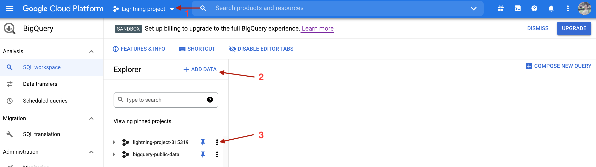
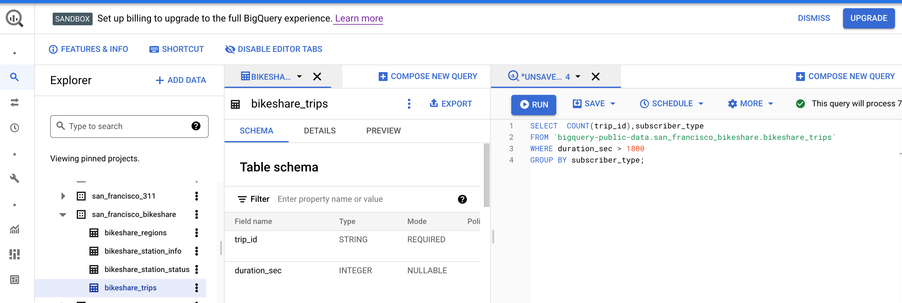
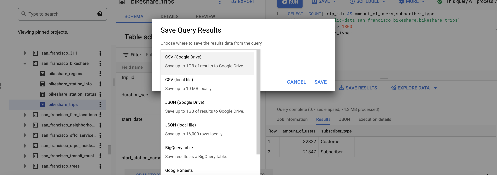

  As soon as we are logged in, in the Navigation menu (upper left corner), under the BigQuery we need to choose SQL Workspace.  And that’s what we see then:



We need to remember the consequences of actions, first of all, we create Project (**1**). After it, clicking on the “Add Data”(**2**)  will enable us to choose between public datasets or make a connection to other external databases, like MySQL, PostgreSQL, AWS, and so on. Then, by clicking on the "More options icon", next to the Project name (**3**), we will create a dataset. And only after the dataset is created, we click again on the "More options icon" next to its name and choose to create a table. That’s the moment when we can upload the data from an external file, Google Drive, or other storage.
So Project is like a book cover that holds our datasets together, and each dataset holds our tables.
With Bigquery we have 2 options: to work with our data or to experiment with a public dataset. As I don’t have a lot of my private data, I use public data sets for experimenting. So, let's say we have chosen public datasets and now we see them in the Explorer menu. In the dataset 'san_francisco_bikeshare', I choose table 'bikeshare_trips'. We open it with "More options icon" so we can see table schema, details, and preview. To retrieve and filter the data from the table, we need to click “Compose new query” and in the new window, we are gonna write our query.



In the right upper corner, there is a tip, if the query is written correctly, we see a green check and how many Mib this query will be processing. If something is not correct, then it will tell us, at what row there is the mistake.
When we are ready, just press “Run”.
I tried to find the number of customers, who rent  a bike for longer than 30 mins per trip and grouped them according to subscriber type with this SQL query:

  ```
SELECT  COUNT(trip_id)  AS amount_of_users,
		subscriber_type
FROM  `bigquery-public-data.san_francisco_bikeshare.bikeshare_trips`
WHERE duration_sec >  1800
GROUP  BY subscriber_type;
```



Clicking “Save results” gives us options to save it like .csv file, .json, google drive, and so on for further work with it.
Also, we have an option here to save our query or the view, and to schedule our query, which could be convenient, if we were working with the dataset that constantly updates.
