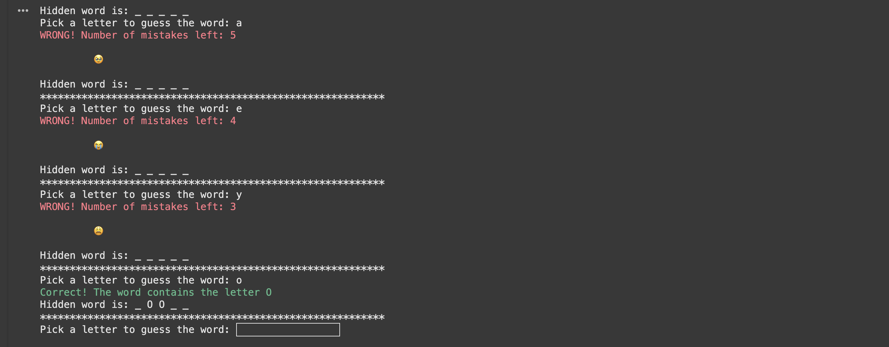

Have you ever played Hangman? It's a fun guessing game that's easy to play and even easier to code. In this post, I'll walk you through creating your own Hangman game in Python—step by step. Don't worry, we'll keep it simple, add a pinch of humor, and make it easy to follow along!

## Step 1: Set Up the Hangman Art Library
First, let's design a dictionary to illustrate the different stages of the game. Instead of sticking to the traditional "hanging man," we can get creative with smiley faces or other fun visuals for a lighter touch. Let's call this our "smiley evolution." This library will serve as a playful progress tracker (or a warning of impending defeat).
````python
    hangman={0:'''
		    🥹
		    ''',
		    1:'''
		    😭
		    ''',
		    2:'''
		    😩
		    ''',
		    3:'''
		    😡
		    ''',
		    4:'''
		    🤬
		    ''',
		    5:'''
		    🥶
		    ''',
		    6:'''
		    ☠️
		    '''}
````

These ASCII art stages will show the progression of the game—from an empty gallows to a full stick figure.
## Step 2: Import the  `random`  Library

Python's `random` module will help us pick a random word for the game. Import it at the start of your script:

````python
import random
````
## Step 3: Create the Word List
Next, create a list of words that players will try to guess. You can include any words you like, but here's a sample list:
````py
word_list = ['PYTHON', 'SERVER', 'LOOPS', 'DEBUG', 'ARRAY', 'LOGIC', 'SMILE', 'LAUGH', 'CHEER', 'HAPPY']
````
## Step 4: Start the Game Logic
Now, let's create the main function, `hangman_play`, which contains the game logic. We'll randomly pick a word, display its hidden form, and start the guessing loop.
````py
def  hangman_play():
	answer_word = random.choice(word_list)  # Randomly pick a word
	hidden_word = "_ " * len(answer_word)  # Display blanks for the word
	remaining_mistakes = 6  # Number of mistakes allowed
	hangman_pic = 0  # Start with the empty gallows

	print(f'Hidden word is: {hidden_word}')
````
## Step 5: Handle Player Input
Players will guess letters to uncover the hidden word. To ensure case consistency, we'll convert their input to uppercase:
````py
while remaining_mistakes > 0:
	picked_letter = input('Pick a letter to guess the word: ').upper()
	
	index_count = 0  # Reset index_count for each guess
	
	for letter in answer_word:
		if letter == picked_letter:
			hidden_word = hidden_word[:index_count] + picked_letter + hidden_word[index_count + 1:]
		index_count += 2  # Account for the spaces in `hidden_word`
````

## Step 6: Check the Guess
If the player's guess is correct, congratulate them. If not, reduce the remaining mistakes and update the hangman picture:
````py
if picked_letter in answer_word:
		print(f'\033[32mCorrect! The word contains the letter {picked_letter}\033[0m')
	else:
		remaining_mistakes -= 1
		print(f'\033[31mWRONG! Number of mistakes left: {remaining_mistakes}\033[0m')
		print(hangman[hangman_pic])
		hangman_pic += 1

	print(f'Hidden word is: {hidden_word}')
	print('**********************************************************')
````
## Step 7: End the Game
If the player guesses the word correctly, congratulate them. If they run out of mistakes, reveal the correct word and display the full hangman.
````py
if hidden_word.count('_') == 0:
			break			

	if remaining_mistakes == 0:
		print('Hanged!')
		print(hangman[6])
		print(f'The correct word was: {answer_word}')

	if hidden_word.count('_') == 0:
		print('Congratulations!')
````
## Final Code
Here's the complete code for the Hangman game:
````py
import random

hangman={0:'''
		🥹
		''',
		1:'''
		😭
		''',
		2:'''
		😩
		''',
		3:'''
		😡
		''',
		4:'''
		🤬
		''',
		5:'''
		🥶
		''',
		6:'''
		☠️
		'''}

def  hangman_play():
	word_list = ['PYTHON', 'SERVER', 'LOOPS', 'DEBUG', 'ARRAY', 'LOGIC', 'SMILE', 'LAUGH', 'CHEER','HAPPY']
	answer_word = random.choice(word_list)
	hidden_word = "_ " * len(answer_word)
	remaining_mistakes = 6
	hangman_pic = 0

	print(f'Hidden word is: {hidden_word}')

	while remaining_mistakes > 0:
		picked_letter = input('Pick a letter to guess the word: ').upper()
		index_count = 0

		for letter in answer_word:
			if letter == picked_letter:
				hidden_word = hidden_word[:index_count] + picked_letter + hidden_word[index_count + 1:]
			index_count += 2

		if picked_letter in answer_word:
			print(f'\033[32mCorrect! The word contains the letter {picked_letter}\033[0m')
		else:
			remaining_mistakes -= 1
			print(f'\033[31mWRONG! Number of mistakes left: {remaining_mistakes}\033[0m')
			print(hangman[hangman_pic])
			hangman_pic += 1
			
		print(f'Hidden word is: {hidden_word}')
		print('**********************************************************')
		
		if hidden_word.count('_') == 0:
			break
	if remaining_mistakes == 0:
		print('Hanged!')
		print(hangman[6])
		print(f'The correct word was: {answer_word}')
		
	if hidden_word.count('_') == 0:
		print('Congratulations!')

# Run the game
hangman_play()
````
## Wrap-Up
That's it! You've built a fully functional Hangman game in Python. It's simple, fun, and a great way to practice loops, conditionals, and string manipulation. Feel free to expand it with more features, like a score tracker or multiplayer mode. Happy coding!

