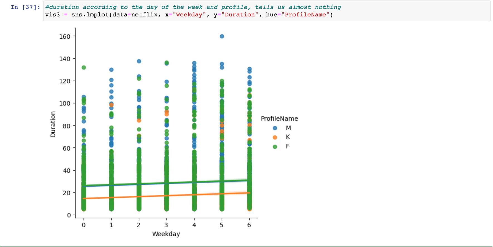

After gaining proficiency in Python through learning and practice, I decided to embark on my own project using my personal data. Lately, it has become quite popular to use Netflix data for small-scale projects, so I started by requesting Netflix to provide me with my family's usage data for the entire period we were subscribed.

The first step is to simply copy and paste our data file into the folder where we save Jupyter files. This is important so that Jupyter can recognize and access the data. Once the file is in place, I can begin working with the data to examine and analyze my viewing activity.

Next, I need to install all the necessary packages required for the analysis. I'll start by setting up a running Docker container, which will help me install the required packages smoothly. After that, I'll install the packages within Jupyter to ensure they are readily available for my analysis.


  To read csv file and create data frame named ‘netflix’ we write:
```
netflix=pd.read_csv('ViewingActivity.csv')
```

Now it is time to **explore the data set**, and there are various ways to accomplish this.

-   To begin, using the command **netflix.head(2)** will display a data frame showing all columns but only the first 2 rows. If we omit the number within the brackets, it will show the first 5 rows by default;

-   If we want to know the dimensions of the dataset, we can use **netflix.shape**, which will provide the number of rows followed by the number of columns.;

-   To gain insights into the data types and the number of non-null values, **netflix. info()** will come in handy.;

-   For a comprehensive overview of the dataset, **netflix.describe()** will describe the data frame by presenting various statistics such as the count, number of unique values, and the most frequent value.

 


-   To check for any null values within our dataset, we can use **netflix.isnull()**. Alternatively, by using **netflix.isnull().sum()**, we can not only identify the presence of null values but also determine the number of null values in each column.

-   If we suspect the presence of duplicates in our dataset, we can utilize **netflix.duplicated()**. This will generate a boolean value (True/False) for each row, indicating whether a duplicate exists. By applying **netflix.duplicated().sum()**, we can determine the total number of duplicates. Fortunately, in my dataset, there were no duplicates. However, if you encounter duplicates, you can remove them by using **netflix.drop_duplicates(inplace=True)**, which will delete the duplicates from your current dataset.

-   To examine the unique values within a specific column, we have two options. If we are simply exploring the dataset and want to see the unique values once, we can use **netflix['column_name'].unique()**. On the other hand, if we wish to store these unique values for future reference, we should assign them to a variable.

 


Now it's time to **prepare our dataset** for analysis. This involves several steps, such as renaming values to maintain anonymity, removing unwanted columns, improving column names, and converting data types.

-   First, we need to review the columns in our dataset and delete any that are not required for our analysis. It's also good practice to rename the columns without spaces to ensure consistency.

  


-   Next, we'll focus on the "ProfileName" column. Instead of displaying the names of family members, we'll replace them with simple identifiers like "M," "F," and "K." We can use the **.unique()** function to quickly verify the changes.

 

-   Convert StartTime column to DateTime format, a data and time format Python can understand and perform calculations with . If you want to convert your DateTime objects to timezone-aware (meaning each datetime object also has a timezone) and you want that timezone to be UTC then set utc=True:

 

-   Similarly, we'll convert the "Duration" column to the TimeDelta format. This format allows us to perform calculations with durations or time differences.

 

-   Additionally, we'll exclude any rows from our dataset with a duration of less than 5 minutes, as those might represent instances where we started watching something but quickly realized it wasn't to our liking.

 


With the dataset prepared, we can now proceed to **analyze** our "netflix" behavior.

-   Let’s start with easy math,and calculate the total number of hours spent with Netflix by dividing the data in minutes by 60, revealing the somewhat alarming amount of time invested in the platform. In those 2393 hours, we could probably learn Chinese.

 

-   To understand our viewing preferences, we'll utilize the seaborn library to visualize the distribution of item durations over the years. This will give us insights into the most common duration preferences.
It's clear from the graph that we prefer short series up to 25 minutes, which I think is true since we spent many hours watching episodes of "Friends" and "Office".

 

-   We'll then determine the number of films with durations exceeding one hour.


-   Next, we'll examine our viewing habits across different days of the week, revealing our frequency of Netflix usage.
What's also shocking is that we're not stopped from watching Netflix, whether it's Monday or Sunday.


-   Furthermore, we'll explore the distribution of viewing times to identify patterns in our watching behavior.


Well, I was suspicious about this number of titles being viewed during night time. So I needed more information about it.


Now I see, because I changed the time to the Berlin time zone, that some movies we watched in Australia and New Zealand were obviously watched at night. Also, the "Big Bang Theory" that my husband watched at night in Germany just means that he was sick and it is his personal medicine to watch it day and night while sick.

-   To gain insight into our international viewing experiences, we'll determine the number of movies watched per country.


-   We'll create separate distributions of durations for each profile, categorizing them by the days of the week. This will highlight the consistent preference for shorter series across all our three profiles.



-   To showcase the number of items watched each year, we'll present the data in descending order. If desired, we can arrange the data in a specific order from the first year to the last using the pd.Categorical function.


-   Using a stacked bar chart with duration on the x-axis and profile names as the hue, we'll visualize the number of items watched by each profile.


-   We'll also explore the usage of the three main popular devices for watching Netflix, providing insights into our family's preferred viewing platforms.

  


The analyses we have performed, provides a broad overview of my family's Netflix viewing behavior, showing preferences in terms of content, time, days of the week, and primary user within the family.


  Finally, I'll share a few handy tips for finding specific values and setting conditions, demonstrating an easy way to achieve these tasks.

  
  
  
