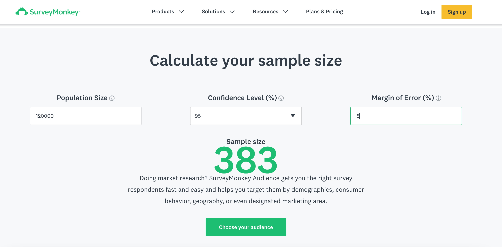

Let's imagine, we work on a people-management project. We need to know, how satisfied our company’s employees are and what they think about the new award program. The problem is in our company we have 5 offices in 5 different countries, overall 120 000 employees. It will be difficult to conduct research and get answers from all of them. The good news is - we don’t need to!

We don’t need answers from all of the employees (that represent the Population here), we will use a Sample of this population, which will be less time-consuming and less costly.

> **Population** - it is all the possible values in one dataset. In our case all employees.

> **Sample** - part of the population that is representative of the population.

To figure out how big our sample should be, we just need to know our Confidence level and Margin of error.

> **Confidence level** - the probability that sample reflects the whole population, measured in percent. The industry standard is 95%.

> **Margin of error** - the maximum expected difference of Sample’s results from actual Population’s results, measured as a percentage.

To calculate our Sample size we will use one of the many free online calculators. For example,

[https://www.surveymonkey.com/](https://www.surveymonkey.com/).

So in our case, we put in Population size: 120 000, Confidence level: 95%, and Margin of Error: 5%. And almost immediately we know that we need to get responses from 383 of our employees.

The further question is should we ask the first 383 employees on the list, or the last 383, or should we choose them from the middle? To answer this, we will divide 120 000/ 383 = 313, and it means that if we ask and get a response from each 313th employee from the list, our sample will represent our whole population.

> The sample like this we can call **Random Sample**, where each member is chosen by chance and there is no bias.

> Another type of Sample is **Representative** when the sample is chosen from the population on a group of factors or qualities, like gender, marital status, age.

But how can we be sure, everybody will answer us? We can’t!

Let’s assume our expected response rate is 50%, then it just means we need to send the survey form to 766 employees.
>How we calculate it:  (383 * 100% )/ 50%= 766.
