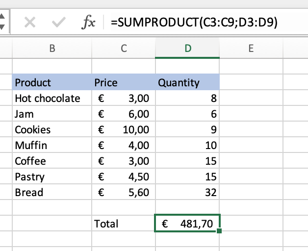

There are a huge amount of useful functions in Excel, that will cover almost every need. In addition to the functions, I have already described in the data cleaning process, which, of course, can also be used for analysis. I would like to tell you about other important functions, which, in my opinion, are very important in data analysis:

-   **VLOOKUP** - vertical lookup, searching for the corresponding value. The secret is that we need to organize our data so that the value we lookup is to the left to the return value we want to find;
-   **XLOOKUP** - similar to VLOOUP, but offers more. It searches for values in a range or table and returns matched results. Here we can lookup for the matched result in any column;
-   **XMATCH** - new version of MATCH function, it searches for a specified value in the range of cells and then returns its relative position.
-   **INDEX** - returns the value of the specified cell or the range of cells from within a range. It can be used together with XMATCH where it specifies the position of searched value;
-   **SEARCH** - locate one text string within another text string and returns the number of starting position of the text string’s first element;
-   **SUMPRODUCT** - great function to simplify calculations. By default, it multiplies the values of each column to each other, but the operation can be changed to addition, subtraction and division.
>The easiest way we can use it, when we have 2 columns of values that should be multiplied, for example, sales for day- there is the list of products, prices, and quantity of each product, that was sold.

>Also, if we have a dataset like in the next example, we can even make it interactive. It will show ("Sales" - "Expenses") for each Agent, that we write in the corresponding cell.

- **AVERAGE / AVERAGEIF** - returns the average value of the given cells in a range. And doing the same, but only for those that meet the given criteria;

- **YEARFRAC** - to count the number of years between 2 dates;
