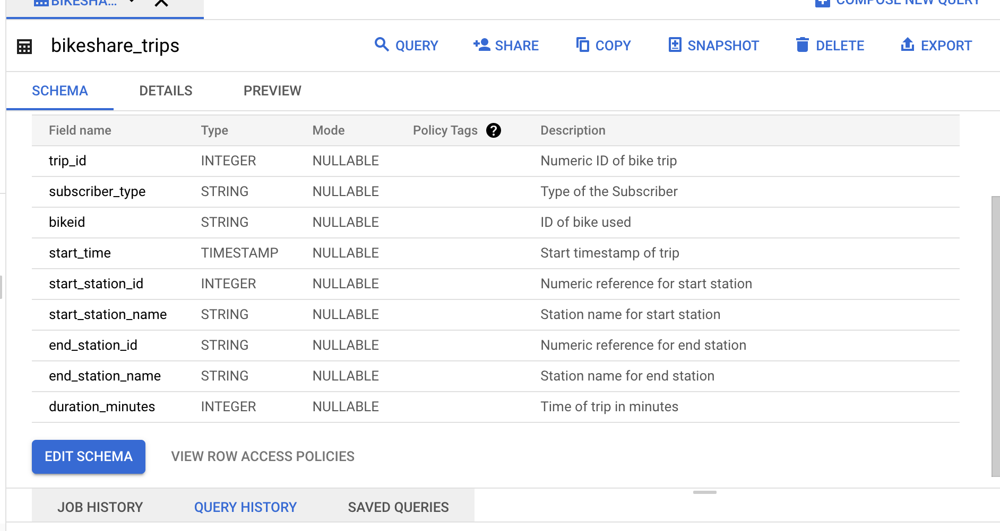
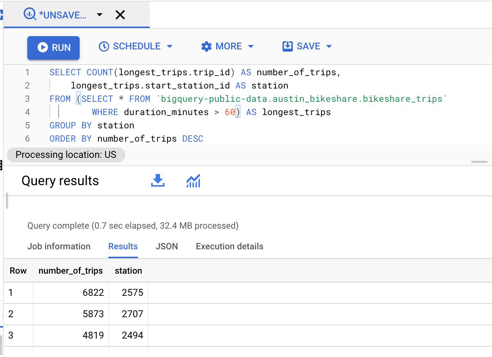

**Subquery** is a statement that appears inside another query statement. It is also called an inner or nested query. The inner query executes first, then the result is passed to the outer query to work with. The subquery can only have 1 column specified in the SELECT statement. We can write subquery after SELECT, FROM, or WHERE in the outer query.
```
SELECT product,
	(SELECT AVG(price)
	FROM product_price) AS price
FROM product_price;
```


As an example, I would like to use the public dataset again (austin_bikeshare). We have a schema like this:



Let’s say we want to find the start station and the number of trips from there, but we are only interested in trips that are longer than 60 minutes. So in the subquery, we filter out all the trips that were shorter than 60 minutes and aliasing this subquery as longest_trips. After this, we can refer to it like to the independent table and count the number of trips while grouping the station id.



Also, sometimes subquery is used instead of a **JOIN** function, so with its help, we can get the data from both tables.
From the performance point of view, a subquery is executed slower than JOIN.
We are using the JOIN function to join 2 or more tables. There are different types of JOIN:
An **INNER JOIN or JOIN** is a function that returns records with matching values in both tables.
A **LEFT JOIN** is a function that will return all the records from the left table and only the matching records from the right table.
**RIGHT JOIN** does the opposite. It will return all records from the right table and only the matching records from the left.
**FULL OUTER JOIN** combines RIGHT and LEFT JOIN to return all records in both tables.
There is also a **CROSS JOIN** (or cartesian), it returns all rows joined from both sides.
For example, if we have 2 rows in table_1 and 10 rows in table_2. Executing CROSS JOIN on both tables will give us 1 table with 20 rows without any matching.


There is also self-join when you join the same table and aliasing it 2 names. Usually, it is made to find a row-dependant relationship. An example of it:
```
SELECT e.LastName AS Employees, m.LastName AS Managers
FROM Employees e LEFT JOIN Employees m
ON m.EmployeeId = e.ReportsTo;
```

However, it is advised to use the window function instead, as self-join can cause poor performance.
