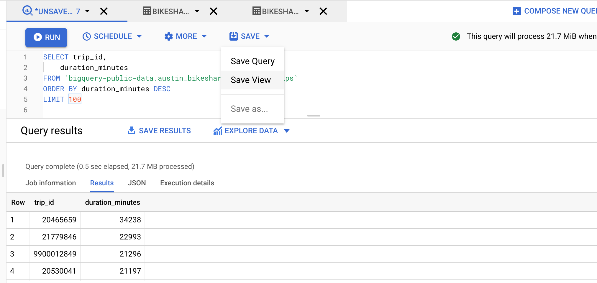

Another way to make our queries easier is to use a view in BigQuery. A **view** is a virtual table with data, where the content is defined by a SQL query.  It means, as with the temporary table, we write a query that describes which columns from which tables and under what conditions we call. Then we save it using the 'save' -> 'save view' buttons, where we define where exactly we save this view. When it is successfully saved, we can use it as a normal table in our SQL queries.

So it's the same as temporary tables, you will say. It looks like that, but it's not the same.
We don't need to use WITH...AS before querying data from this table. In the case of a view, we refer to it as a normal, already stored table in the database.
A temporary table and its results exist for the entire database session in which it was created. On the contrary, a view exists only during a single query. Each time we use the view name, it generates its content from the saved query in view, and it uses the current data every time. So even if the table is constantly updating, you will always have the current version of it.
