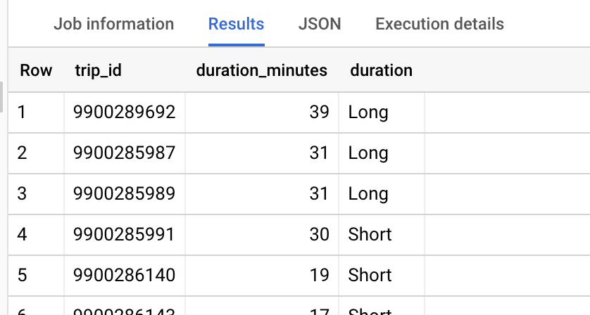
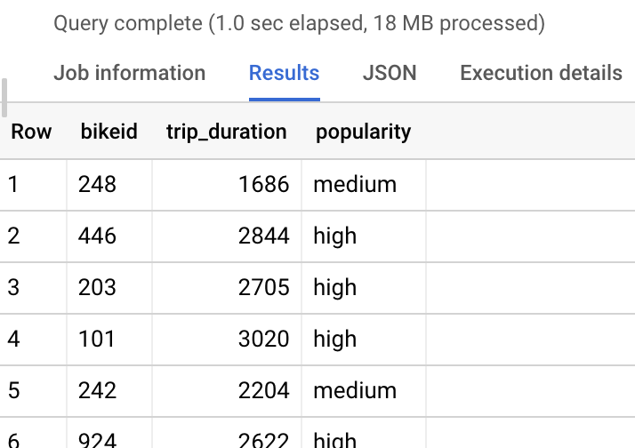
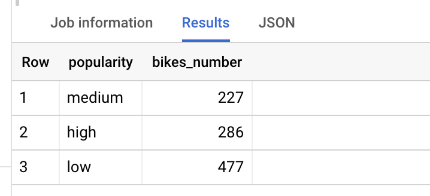

There are 2 effective tools when we need to group our data or to entitle new value.

**IF function**

The IF() function returns a value if a condition is TRUE, or another value if a condition is FALSE. It generates a new column for the answer and you can assign a name to it:
```
IF(condition, value_if_true, value_if_false) AS new_column_name
```
Of course, an example is with my favourite bikeshare dataset.
```
SELECT trip_id,

duration_minutes,

IF (duration_minutes > 30, "Long", "Short") AS duration

FROM `bigquery-public-data.austin_bikeshare.bikeshare_trips`

LIMIT 100
```
The result was:



**CASE statement**

CASE returns records with your conditions by allowing you to include if/then statements in your query. It can be used in SELECT, INSERT, DELETE, and UPDATE statements and is another perfect tool for grouping data and entitling new values.

For example, let’s group our bikes according to the time they have been rented out, to low, medium, and high popularity. In that way, we will know how many of them need to be repaired, so we can plan our budget. We set the conditions for grouping and name the new column where the new data will be recorded.


```
SELECT DISTINCT bikeid,

COUNT(duration_minutes) AS trip_duration,

CASE

WHEN COUNT(duration_minutes) <= 1000 THEN "low"

WHEN COUNT(duration_minutes) > 1000 AND COUNT(duration_minutes) < 2500 THEN "medium"

ELSE "high"

END AS popularity

FROM `bigquery-public-data.austin_bikeshare.bikeshare_trips`

GROUP BY bikeid
```
The result is as follow,



we grouped our bikes, but so far it didn’t give us any new information. Now we need to count the number of bikes in each group, for this, we will use our previous query as a subquery.
```
SELECT popularity,

COUNT(bikeid) AS bikes_number

FROM

(SELECT DISTINCT bikeid,

COUNT(duration_minutes) AS trip_duration,

CASE

WHEN COUNT(duration_minutes) <= 1000 THEN "low"

WHEN COUNT(duration_minutes) > 1000 AND COUNT(duration_minutes) < 2500 THEN "medium"

ELSE "high"

END AS popularity

FROM `bigquery-public-data.austin_bikeshare.bikeshare_trips`

GROUP BY bikeid)

GROUP BY popularity
```
And, finally, the result gives us the information we needed, so we definitely need to plan money in our budget for check-ups and maybe some repair work for at least 286 bikes.


