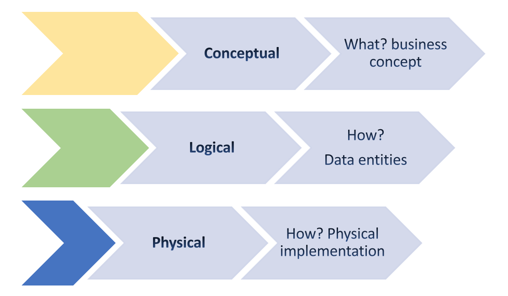
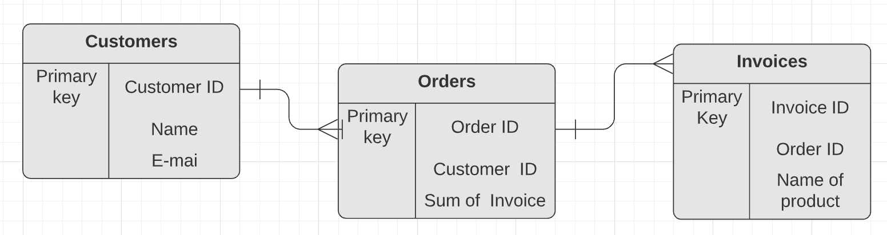

First of all, what is the Data model?

**Data model** - is a model that is used for organizing data elements and how they relate to one another.

**Data elements** - pieces of information, such as people's names, account numbers, and purchases.

**Data modeling** is the process of creating diagrams that visually represent how data is organized and structured. These visual representations are called data models.

There are 3 types of Data modelling:

- **Conceptual** - data model defines What? the system contains. It organizes, defines business concepts and rules.

- **Logical** - it defines How? The system should be implemented. Contains technical details of the model such as entities, attributes and relationships.

- **Physical** - defines How? The system should be implemented with specific DBMS.

There are a lot of approaches when it comes to data modeling. The most common types of data modeling are:
- **ERD** (Entity relational Diagram) it’s the technique for modeling and the design of relational databases. It has entities representing objects or tables in RDB, attributes of entities including data types, and relationships between entities, including primary and foreign keys.

- **UML** (unified modeling language) **Diagram** - that is equivalent to ERD diagram but used mostly with object-oriented programming languages, to visualize the design of the system.
- **Data dictionary** is the list of data tables, attributes to each table, data types, descriptions, and relationships between tables.
