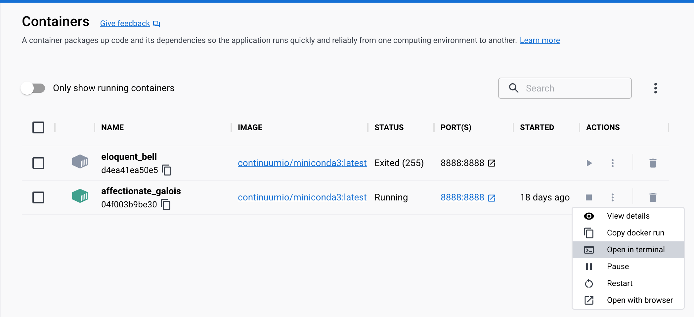

As I was working for BI analyst already for some time, I have realized the importance of learning Python programming language, given its widespread popularity and time-saving capabilities. If you are also considering this path, I would like to share some easy steps to get started with Python.

My main goal was to create an image container and run it in Docker with Anaconda, using Jupyter Notebook for code writing and specifying where to save all my notes. This approach allows me to save the resources of my laptop.

First, I installed package manager [Homebrew](https://brew.sh/), pasting the following code in the MacOS Terminal:
```
/bin/bash -c "$(curl -fsSL [https://raw.githubusercontent.com/Homebrew/install/HEAD/install.sh](https://raw.githubusercontent.com/Homebrew/install/HEAD/install.sh))"
```
Next, I used Homebrew to install Docker Desktop:
```
brew install --cask docker
```
Afterward, I created an image of a container with Conda and simultaneously told it to run Jupyter and where to save my files with code. I also used Conda to install additional Python packages in the future. To achieve this, I ran the following code in the Terminal:
```
docker run -it -v ~/jupiter:/opt/notebooks -p 8888:8888 continuumio/miniconda3 /bin/bash -c "/opt/conda/bin/conda install jupyter -y --quiet && mkdir -p /opt/notebooks && /opt/conda/bin/jupyter notebook --notebook-dir=/opt/notebooks --ip='*' --port=8888 --no-browser --allow-root"
```
Once the code was successfully executed, I was provided with an address to run in the browser to access the notebook and the URL to use.

Now, I was able to access Jupyter Notebook and begin working on it right away. My work was saved in the folder named ‘Jupyter’. It is important to note that when I stopped the Docker container, I had to run it again using the same lines of code as the first time.

To further enhance my Python skills, I needed to install additional packages. To do so, I opened the running container in Docker, clicked on Actions, and opened the Terminal. For instance, if I needed to install the pandas package, I wrote
```
conda install pandas
```
in the Terminal, waited for it to complete, and then returned to my Jupyter Notebook to write
```
import pandas as pd
```
and run it.





This is all you need to get started with Python and its additional packages. It may seem complex at first, but with some practice, it will become second nature. I hope this helps you on your Python learning journey.
