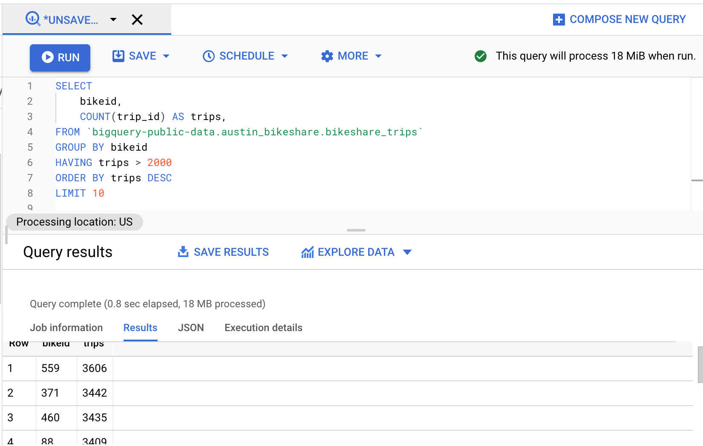

The simplest query in SQL looks like this:
```
SELECT col_name
FROM table_name
WHERE col_name2 > y;
```
If we want to group our column results or to order them in alphabetical or numerical order, then after the WHERE statement we can add:
GROUP BY col_name
or
ORDER BY col_name;

There are **aggregate functions** - the functions that perform calculations on a set of values and return a single value.
Examples are:
- AVG,
- COUNT,
- SUM,
- MIN,
- MAX;

If we add DISTINCT, it will use only values, that aren’t repeated:
SELECT COUNT(DISTINCT user_id)

If we want to use aggregate functions, we need to be careful, as we cannot use them with WHERE condition. For aggregated functions, we need to use GROUP BY + HAVING. For example:
```
SELECT bikeid,
COUNT(trip_id)  AS trips,
FROM  `bigquery-public-data.austin_bikeshare.bikeshare_trips`
GROUP  BY bikeid
HAVING trips >  2000
ORDER  BY trips DESC
LIMIT  10
```

