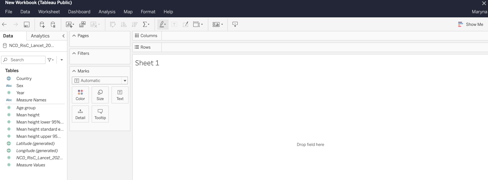
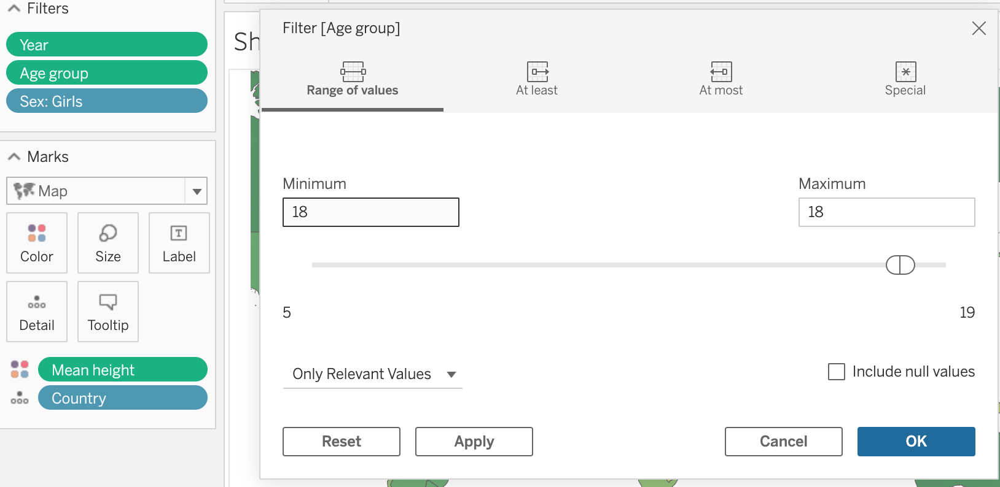
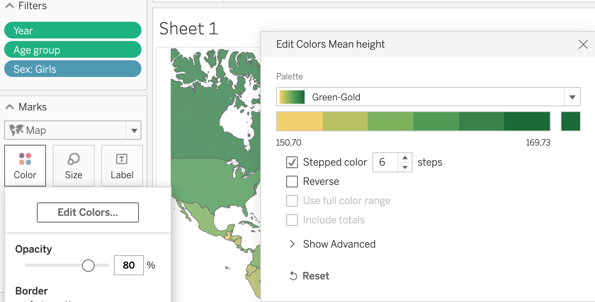
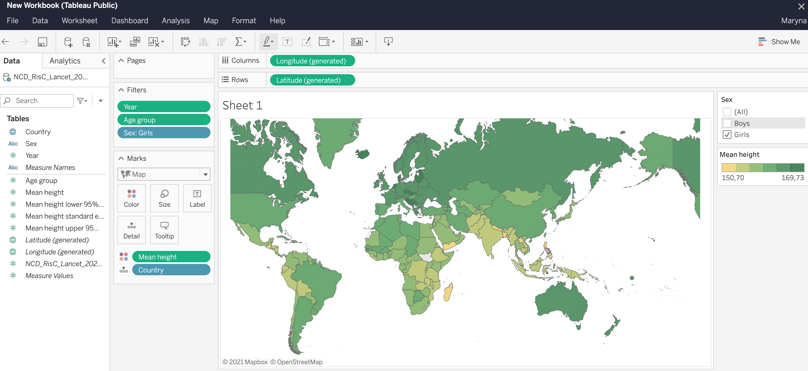

> **Tableau** - it’s a powerful data visualization tool.

I wanted to make an experiment with Tableau, and as I recently found a very interesting dataset on human height, I want to use it here. The dataset is from the website [https://ncdrisc.org/](https://ncdrisc.org/), which is the community of health scientists, who provides data on major risk factors for non-communicable diseases. All the data you can freely download on this website plus they’ve already done some very nice visuals on it.

So, first of all, I will make my public account on the Tableau platform, then in my account, I need to choose “ create a viz”. After it, we need to download the data source for our future project. It can be a file with our dataset or connectors like Google Drive or OData. Finally, when our data is downloaded we see their interface like this.

The logic behind it, that you make worksheets with different visuals, and then you can join them all together in one dashboard or story.

On the sidebar, we have a data pane and an analytic pane. On the data pane, we have measure names and measure values, it is qualitative and quantitative values from our dataset. Additionally, we can create calculated fields, using calculations and then referring to them as part of our data source.

Basically, we need to drag and drop our fields from the data pane to the cards, shelves, or view area. In that way, we determine what will be where and what filters, visuals we gonna use.

So, for our dataset, we gonna drop the field Country to the card “Detail” and choose in the drop-down menu viz “Map”. That will show us a map in the view window.

Then we gonna drop fields: age, year, and sex to the card “Filter”. Clicking on each field will open the filter window, where we can choose the range of values we need. For the age, we choose 18, for the year: 2019 and for the sex, we click open menu and chose “show filter”. In that way, we filter out the data we don’t need, and sex we can always change in the filter on our right.

After it, we need some data to show on the map. For this, we drag and drop the field “Mean height” to the card Color. It will color our map in different colors, but be careful. In that way, it automatically shows not Mean height, but SUM(Mean height). To change it, click on the field, and in the drop-down menu choose Dimension instead of Measure.

Then click on Color card -> Edit colors. We want to make our colors more contrasted, so we choose the palette, in my case it’s Green-Gold, then check Stepped color, 6 steps. And Ok.

In the end, we change the name of the worksheet and here it is, our simple but pretty nice interactive visual, that shows the mean height for 18 years old people, according to country and sex.

What we see here it’s that closer to the equator the height of people is slightly lower than if we look further from the equator. What are the reasons behind it? It could be weather conditions or the quality of food and access to clean water and medicine. Of course, the cause could be something else entirely, and to find it out, another date analysis would have to be done. Or maybe even more than one.

