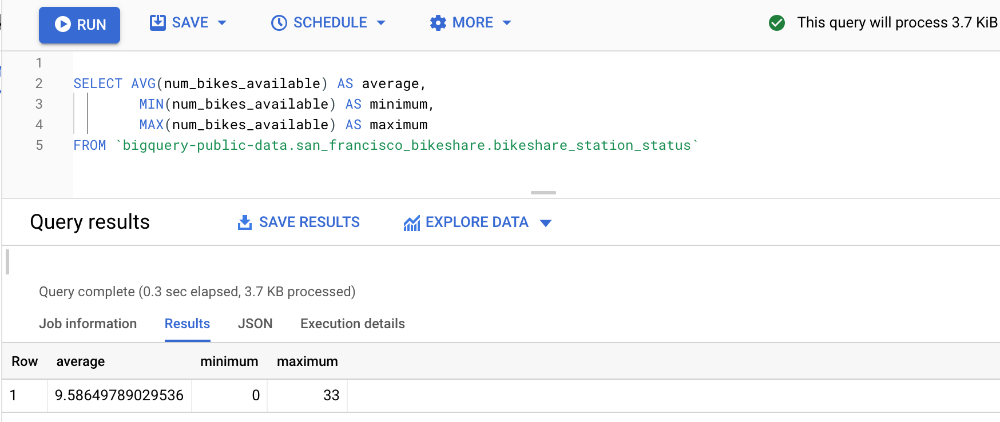

A **temporary table** stores data within the database session, in which it was created. When the session is ended, the dataset is automatically deleted. We are using a temporary table when we need to use some specific data for several SQL queries within one session. They can collect the results of multiple, separate queries or store a filtered subset of the database. You don’t need to select and filter the data each time you work with it. Using temporary tables simplifies our SQL queries and makes them easier to understand for others.
There are different ways to create temporary tables, like clauses WITH … AS, SELECT… INTO, CREATE TEMP TABLE.
The syntax is as follow:
 ```
WITH new_table_name AS(
SELECT col_name1
FROM table_name)

SELECT *
INTO new_table_name
FROM table_name
WHERE col_name = “Germany”

CREATE TEMP TABLE new_table_name AS
(
SELECT *
FROM table_name
WHERE col_name = “Germany”
)
```
Within a session temporary table works like a normal table, you can perform the operations SELECT, INSERT, DELETE with it. After the session ended, the tables, that were made with SELECT... INTO and WITH...AS statements are automatically deleted.
The temporary table that was created with CREATE TABLE statement is added to the database and it is the user’s responsibility to delete or drop it. In that case, using **DROP** table_name will delete not only the rows of the table but also columns and table definition. Using **DELETE** table_name statement will delete only rows, but leaves the columns of the table to be used again.

I prefer using WITH … AS statement.
For example, returning to our open public dataset. Let’s now use the  ‘san_francisko_bikeshare’ dataset. With a temporary table ‘popular_bike’ I will find the most popular bike and what is its starting station.  Then in my next query, I will join another table to my temporary table and will find how many bikes are available on this starting_station. It is for the reason, to find if this bike is popular only because there is a lack of them on this station or it is just a popular starting point.
```
WITH popular_bike AS (
   SELECT bike_number,
       start_station_id,
       (SUM (duration_sec)/3600) AS duration_of_use   --to find the time in hours we will delete duration on 3600
   FROM `bigquery-public-data.san_francisco_bikeshare.bikeshare_trips`
   GROUP BY bike_number, start_station_id
   ORDER BY duration_of_use DESC
   LIMIT 1)

SELECT a.bike_number,
   a.duration_of_use,
   b.station_id,
   b.num_bikes_available
FROM popular_bike a LEFT JOIN  `bigquery-public-data.san_francisco_bikeshare.bikeshare_station_status` b
ON a.start_station_id = b.station_id
```



This result tells us that the most popular bike Num.535 has been rented for 4805 hours. It lives on the station with Id.66 and the number of bikes available there is 25. Is it a lot? Or is it not enough? To answer this question we need to know the number of bikes on other stations. So I have found an average, minimum and maximum number of bikes for all the stations.


With this data, we can definitely say that 25 bikes it’s well over average and most probably this station is the popular starting point.
