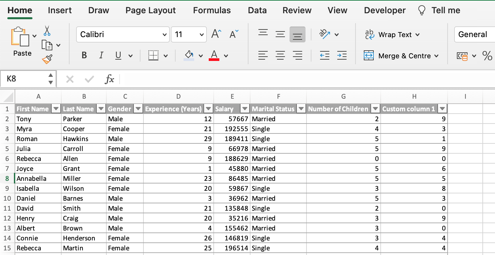
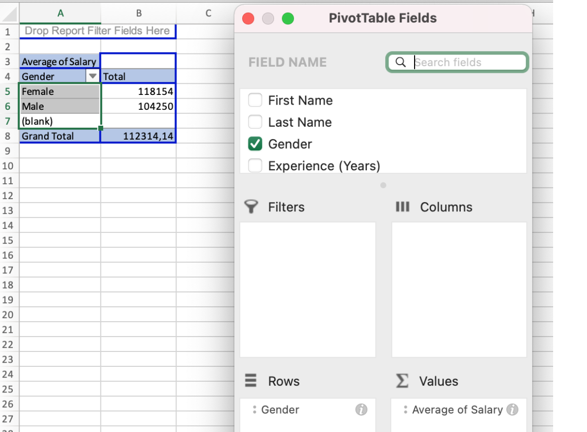
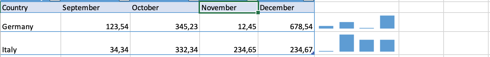
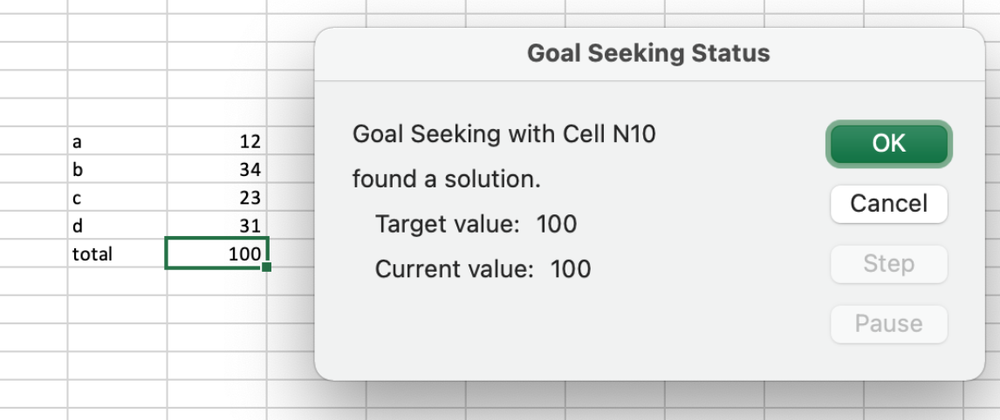

Excel offers a wide range of tools for data analysis.

I want to tell you shortly about my favorite, as I found it the most convenient and productive.

1.  **Pivot tables** - it is a powerful tool that can quickly summarize, count, and sort data in the table. It is very easy to work with, as you practically make the structure of your pivot table by dragging and dropping columns name into the needed fields. For example, how to find the average salary for males and females in 3 steps, from the dataset, that has more than 50 rows:
    - Highlite dataset and click insert pivot table;
    - In pivot table fields drag Gender and drop it to the field Rows;
    - In pivot table fields drag Salary and drop it to the field Values, change the value to Average;
    It’s ready! Now we see the average salary for males, females and total.

    

    

    

2.  **Conditional formatting** plays a big role in cleaning data as well as in analysing data. You can set any rule to highlight the values, add data bars, color scales, or icons to the value in the cell;

3.  **Sorting and Filtering** - allows you to organize your data, select only what you need, or just focus your attention on what you're looking for;

4.  **Sparklines** - the small charts in worksheet cells, that provide a visual representation of the data;

5.  **What - if analysis** with **Goal seek** tool let us figure out which set of values will produce the result in the formula, that we need. For example, we have 3 values, and 4th is unknown yet, but the sum of all 4 values should be 100. We set up a Goal seeker and it tells us the searched value.

6. **Analyse Data** and **Recommended charts** - these tools give the user very useful tips when exploring the dataset.
