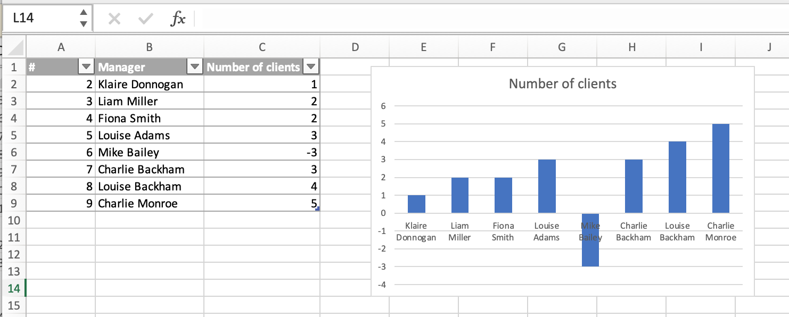
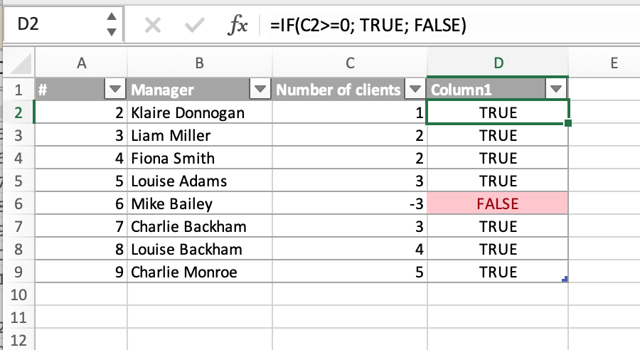

Let’s say, we have a dataset with a list of managers and the number of clients they manage. There are several ways to check the column with the number of clients, and I think the fastest is visualization. We know that the number, in any case, should not be less than zero, because this is the number of clients, they either are or are not. We make a line graph based on our table.



The graph clearly shows an error with the number of customers of Mike Bailey. Of course, this is not the chart to show our stakeholders, but with its help, we can easily see an error in the data.  And then, we need to delete the temporary chart, fix the data, if possible, and continue checking our dataset.

 This is a very simple and illustrative example. And of course, if our dataset is also so small in real life, we can see this error without the graph. But imagine that instead of 9 managers we have 90 or more on our list, then the method with data visualization will help us to check the data very quickly. Also, you can use a data validation tool, conditional formatting, or an IF function with a given condition, such as this:

```
=IF(C2>=0; TRUE; FALSE)
```

 Then our table will look like this, and you will also see where the data does not fulfil the requirements.


