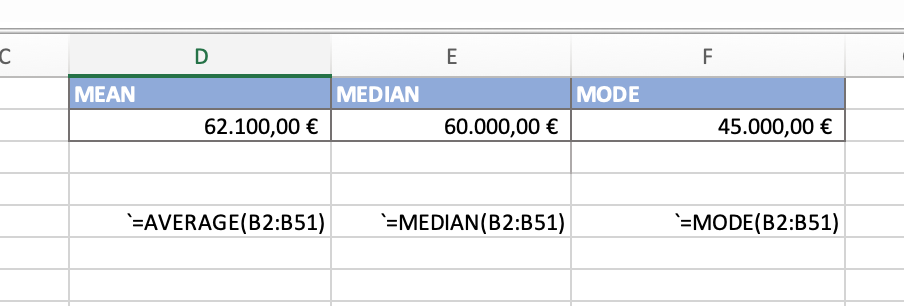

We often hear phrases like: On average, an average person, average salary, average temperature, and so on. But what average exactly are we talking about?

There are **3 types of average**:

-   **Mean** - the sum of the number divided by the number of cases;
-   **Median** - the middle value, if all the values are put in order;
-   **Mode** - the most common value;

The easiest to understand, in my opinion, is mean. It is simple, the sum of the values divided by the number of those values.

Let's look at an example. We have a set of data about the firm's 50 employees and their salaries. The range of salary from 120 000 Euro to 35 000 Euro, in Excel Worksheet range of cells is B2:B51. If we count all types of average for this example we gonna have these numbers:

The difference is pretty big and the question is what type of average would be right for this example? Everyone chooses for themselves. But when you hear that some data is average, it's always worth asking, what average exactly? After all, if someone has a caviar sandwich and others have nothing, that doesn't mean that their average is bread and butter.

When calculating the average, it's always important to look at the questions and find out the right average, which will help us solve them.
