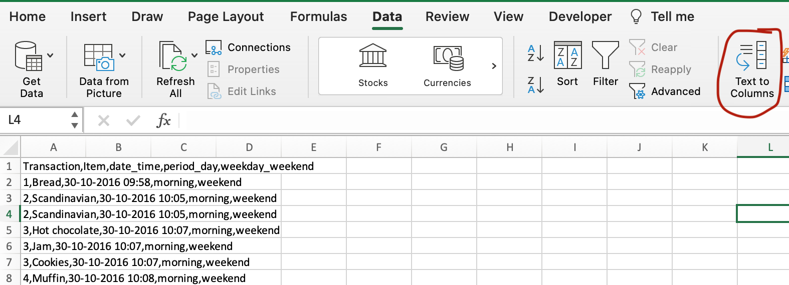
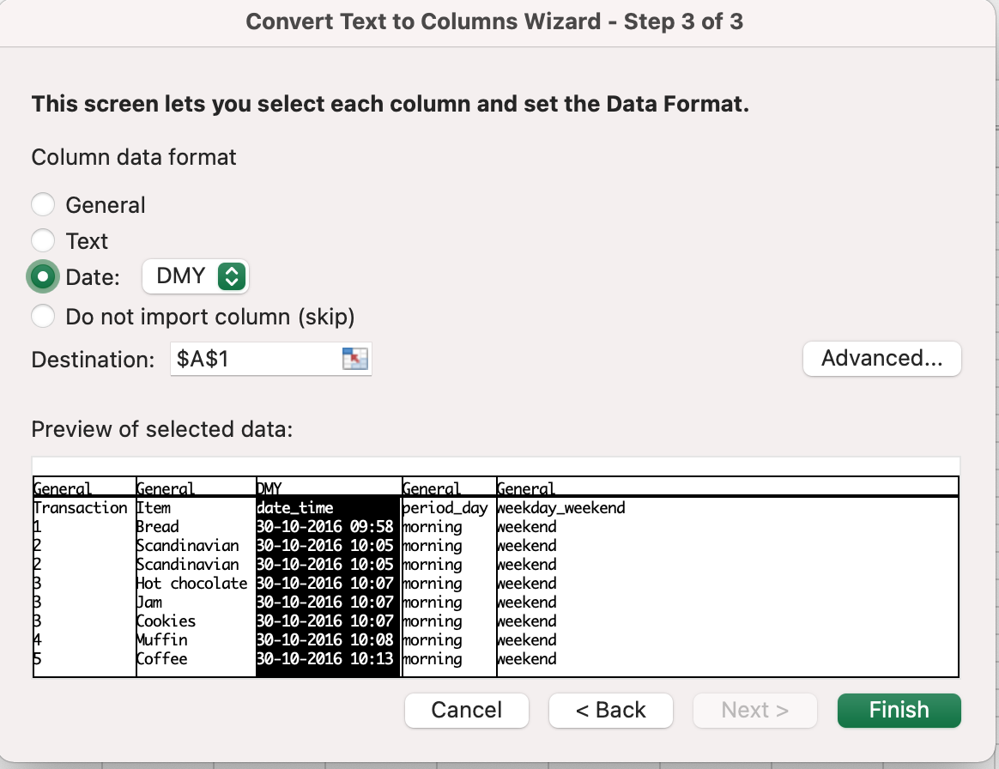

As I was learning, I've often encountered files with a .csv extension.
There is one quick and effective way to work with them more conveniently in Excel.
When we open such a file, we see the data without distribution into columns.

To resolve it, highlight the first column, choose the tab Data and click “Text to Columns”. The new window of Column Wizard will be opened. Choose the “Delimited” and then the exact delimiter, that you have in your file.

>Delimiters - it's a separator that specifies the beginning and the end of the value, could be blank space, comma, semicolon, or other.

Our delimiter here is a comma, so we specify it. Now in the preview, we see what’s our table is gonna be look like.

In the next step, we can specify the data type for each column or just leave it the general type.  My advice is to specify the Date data format for your date and time data. Otherwise, it may be imported into the table in text format, which will cause some additional work.
And that’s all about importing .csv files into Excel.
